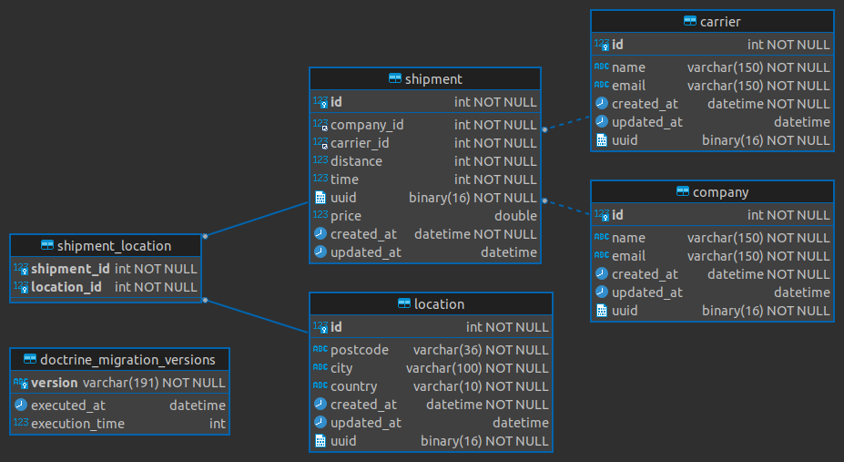

# InstaFreight Shipment

## about this api

### requirements
this api is running using dockers services what you need is 
- docker [how to get docker](https://docs.docker.com/get-docker/)
- docker-compose [how to get docker-compose](https://docs.docker.com/compose/install/)

### how to start application
this is very simple docker with a helper shell script that make it easy for you to run LEMP server.
for start first you can clone it or download it and then follow these step to make project run

- you have a helper bash script file with **spm** name in root folder of project ,this shell script helper allow to easily work with this project.
- please following these step to run the project :
  - first execute this command { ./spm --init} by running this command a new alias set for spm in /usr/local/bin directory and then you cn easily use spm without ./ prefix.
    furthermore it's initialize project for you its do whatever task should be done and bring project up for you
  - if you want see what type of commands you have here to use. just run spm -h|spm help 
  - for this project ,php 8.1 , symfony 6 and api_platform work together
  - there is test provided in this project you can run them using spm test and if you want to pass phpunit argument it's possible
    like spm test --filter="test name or test method"
  - after all services in dockers comes up and running you can access the api using this url : http://shipment.localhost/api
  - for import shipments data to system there is command line which help you to do that 
    
<code>spm -c shipment:import "your filename"</code>

    also as it may contain a lot of shipments data it's more wise to import them chunk by chunk to do that
    there is two options fo this command :
      -f | from  which you pass an integer which indicate the index of data that you want to  import, and it's zero base 
      -t | to  which you can pass an integer which indicate the last index  of data that you want to import fo exmaple for 
    first 1000 items you can use this
    
<code>spm -c shipment:import "your filename" -f 0 -t 999</code>

    in this way you can define a cron job to execute this command parallel in multiple session and import data using multiple chunk

### hints
- if you get this error [The Compose file './docker-compose.yml' is invalid because:
  services.web.volumes value [':/var/www/html', ':/var/www/html/vendor', ':/etc/php///conf.d/override_php.ini', ':/etc/php///conf.d/override_php.ini', ':/etc/msmtprc']has non-unique elements
- ] ignore it, because it's back to .env file which at first doesn't exist but the command automatically create them 
  using .env.example and .env.test.example and then run docker-compose :smiley:
- about database structure you could find it here  in ShipmentERD.png file 
- there is some portion in this task which is not provided like oauth and security concept as it's 
not mentioned in task
- there is some mistake also in task itself specifically about distance and calculation process :
  - as distance come as meter should be converted to kilometer during calculation. problem is that the condition 
   that defined in task is not fulfil all situations  like what about distance bigger than 300 but smaller than 301,
    anyhow I handle this also in code 

- as you check the code I inject logger service for doing log in code , but as I'm working on more than 5 tasks then I don't complete it
  but it's not hard 

### Thank you so much 
At the end I want to thank you for this challenge that you gave me , and please provide feedback if it's possible.

   
